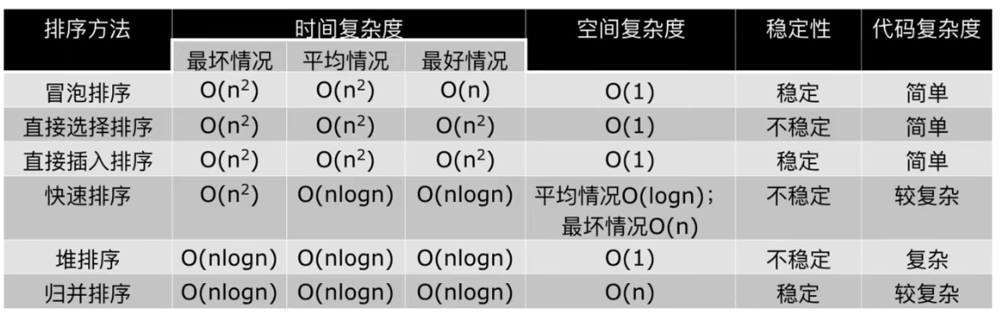

# Quick Sort & Heap Sort & Merge Sort

1. 三种排序算法的时间复杂度都是 O(nlogn)
2. 一般情况下，就运行时间而言: Quick Sort < Merge Sort < Heap Sort
3. 三种排序算法的优缺点
- Quick Sort: 极端情况下排序效率低
- Merge Sort: 需要额外的内存开销
- Heap Sort: 在快的排序算法中相对较慢

注意其中快速排序和归并排序的空间复杂度是由于递归要存储每一次过程. 即要存储多少层. 而归并排序由于本身就要新创建一个列表.O(n) > O(logn).
稳定性是指元素原本的相对顺序在排序后是否会发生改变.